# Advanced System Workflows & Integration Scenarios

## Table of Contents
1. [Advanced Authentication Workflows](#advanced-authentication-workflows)
2. [Error Recovery Workflows](#error-recovery-workflows)
3. [Performance Optimization Workflows](#performance-optimization-workflows)
4. [Integration Workflows](#integration-workflows)
5. [Backup & Recovery Workflows](#backup--recovery-workflows)
6. [Scaling Workflows](#scaling-workflows)
7. [Third-Party Integration Workflows](#third-party-integration-workflows)
8. [Advanced Analytics Workflows](#advanced-analytics-workflows)

---

## Advanced Authentication Workflows

### 1. Multi-Device Login Management

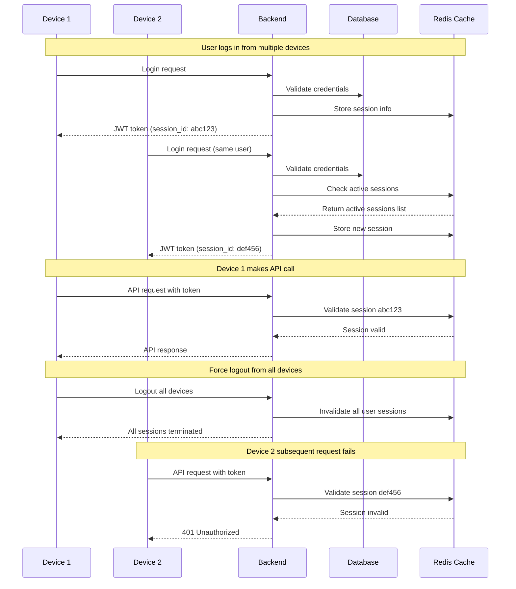

**Implementation Steps:**

1. **Session Storage Design**
   ```json
   {
     "userId": 123,
     "sessionId": "abc123",
     "deviceInfo": {
       "userAgent": "Mozilla/5.0...",
       "ipAddress": "192.168.1.1",
       "deviceType": "desktop"
     },
     "loginTime": "2025-06-17T08:00:00Z",
     "lastActivity": "2025-06-17T10:30:00Z",
     "isActive": true
   }
   ```

2. **Backend Session Management**
   ```java
   @Service
   public class SessionService {
       
       public void createSession(User user, String deviceInfo) {
           String sessionId = UUID.randomUUID().toString();
           SessionInfo session = new SessionInfo(
               user.getId(), 
               sessionId, 
               deviceInfo, 
               Instant.now()
           );
           redisTemplate.opsForValue().set(
               "session:" + sessionId, 
               session, 
               Duration.ofHours(24)
           );
       }
       
       public void invalidateAllUserSessions(Long userId) {
           Set<String> sessions = redisTemplate.keys("session:*");
           sessions.forEach(sessionKey -> {
               SessionInfo session = redisTemplate.opsForValue().get(sessionKey);
               if (session != null && session.getUserId().equals(userId)) {
                   redisTemplate.delete(sessionKey);
               }
           });
       }
   }
   ```

### 2. Token Refresh Workflow

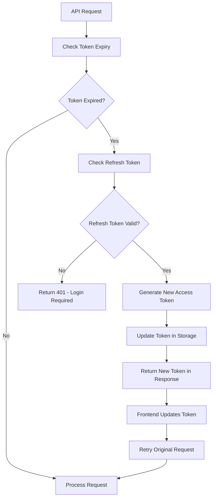

---

## Error Recovery Workflows

### 1. Database Connection Failure Recovery

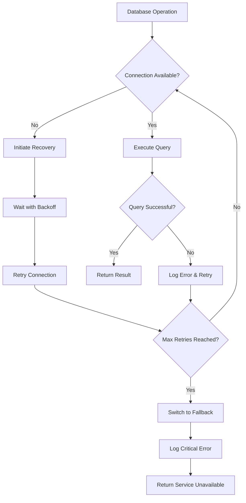

**Implementation:**

```java
@Component
public class DatabaseRecoveryService {
    
    private static final int MAX_RETRIES = 3;
    private static final Duration INITIAL_DELAY = Duration.ofSeconds(1);
    
    @Retryable(
        value = {DataAccessException.class},
        maxAttempts = MAX_RETRIES,
        backoff = @Backoff(delay = 1000, multiplier = 2)
    )
    public <T> T executeWithRecovery(Supplier<T> operation) {
        try {
            return operation.get();
        } catch (DataAccessException e) {
            log.warn("Database operation failed, attempting retry...", e);
            throw e; // Let @Retryable handle the retry
        }
    }
    
    @Recover
    public <T> T recover(DataAccessException e) {
        log.error("All database retry attempts failed", e);
        // Switch to read-only mode or cached data
        throw new ServiceUnavailableException("Database temporarily unavailable");
    }
}
```

### 2. Process Tracking Failure Recovery

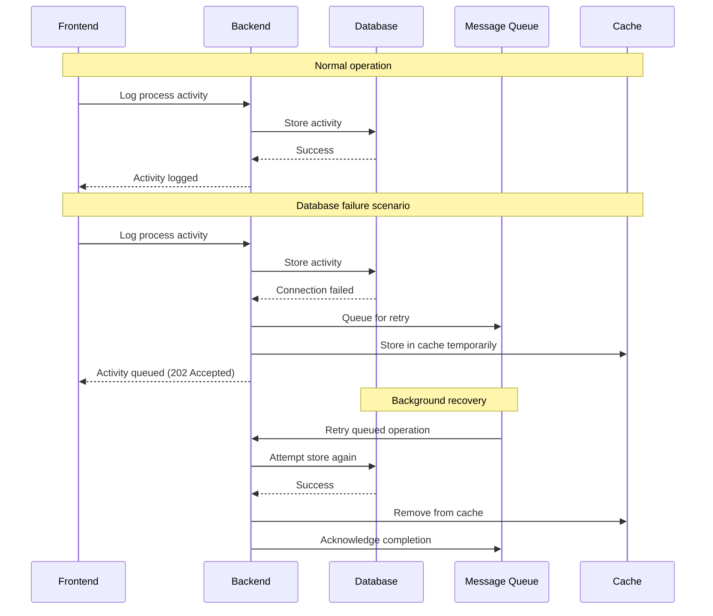

---

## Performance Optimization Workflows

### 1. Query Optimization Workflow

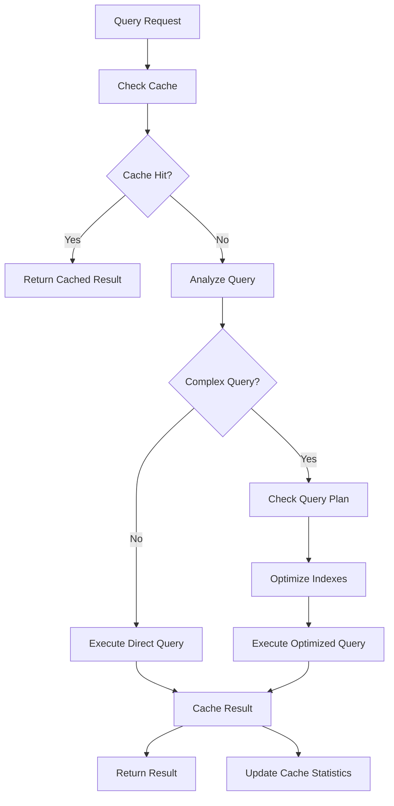

**Implementation:**

```java
@Service
public class OptimizedQueryService {
    
    @Cacheable(value = "analytics", key = "#userId + ':' + #dateRange")
    public AnalyticsData getUserAnalytics(Long userId, String dateRange) {
        // Check if we need to optimize the query
        QueryPlan plan = analyzeQuery(userId, dateRange);
        
        if (plan.isComplex()) {
            return executeOptimizedQuery(plan);
        } else {
            return executeDirectQuery(userId, dateRange);
        }
    }
    
    private QueryPlan analyzeQuery(Long userId, String dateRange) {
        // Analyze query complexity and data volume
        long estimatedRows = estimateRowCount(userId, dateRange);
        boolean hasJoins = requiresJoins(dateRange);
        
        return new QueryPlan(estimatedRows, hasJoins);
    }
}
```

### 2. Memory Management Workflow

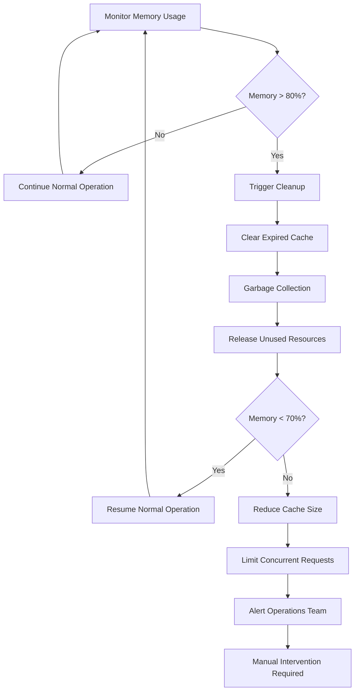

---

## Integration Workflows

### 1. Frontend-Backend State Synchronization

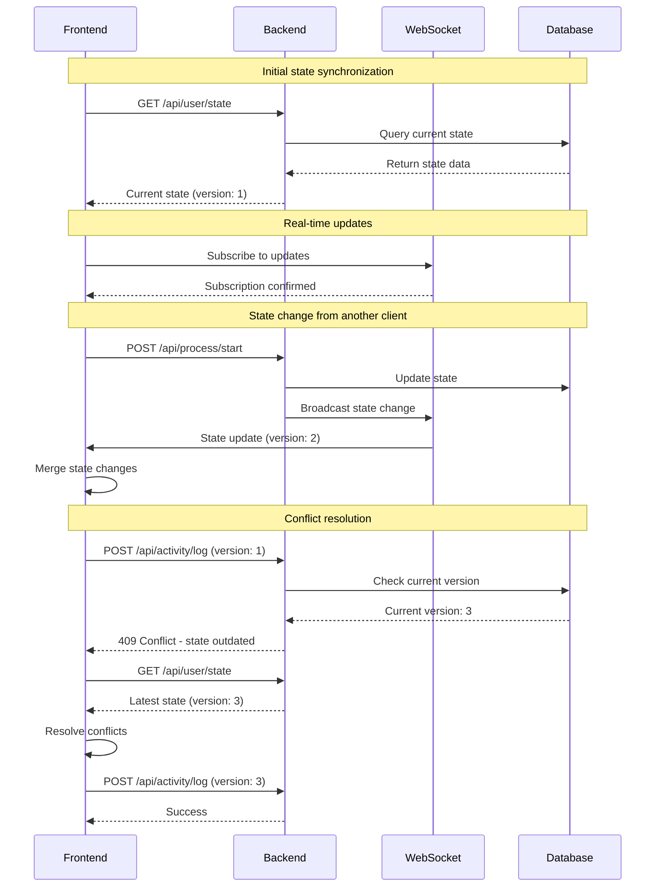

### 2. API Rate Limiting Workflow

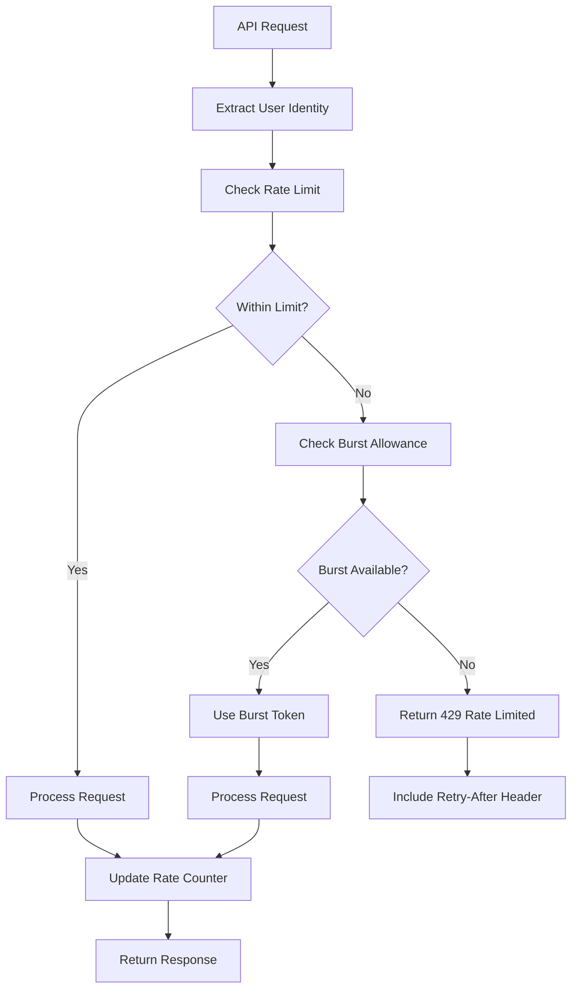

**Implementation:**

```java
@Component
public class RateLimitFilter implements Filter {
    
    private final RedisTemplate<String, String> redisTemplate;
    private final RateLimitConfig config;
    
    @Override
    public void doFilter(ServletRequest request, ServletResponse response, 
                        FilterChain chain) throws IOException, ServletException {
        
        HttpServletRequest httpRequest = (HttpServletRequest) request;
        HttpServletResponse httpResponse = (HttpServletResponse) response;
        
        String userKey = extractUserKey(httpRequest);
        String rateLimitKey = "rate_limit:" + userKey;
        
        // Implement sliding window rate limiting
        long currentWindow = System.currentTimeMillis() / config.getWindowSizeMs();
        String windowKey = rateLimitKey + ":" + currentWindow;
        
        Long currentCount = redisTemplate.opsForValue().increment(windowKey);
        redisTemplate.expire(windowKey, Duration.ofMillis(config.getWindowSizeMs()));
        
        if (currentCount > config.getMaxRequests()) {
            httpResponse.setStatus(429);
            httpResponse.setHeader("Retry-After", 
                String.valueOf(config.getWindowSizeMs() / 1000));
            httpResponse.getWriter().write("Rate limit exceeded");
            return;
        }
        
        chain.doFilter(request, response);
    }
}
```

---

## Backup & Recovery Workflows

### 1. Automated Backup Workflow

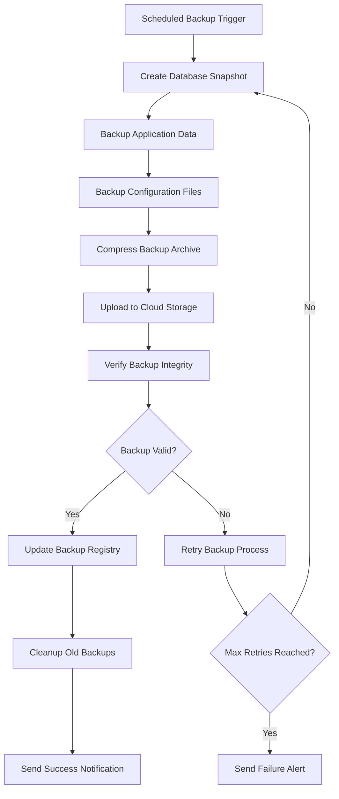

**Backup Script:**

```bash
#!/bin/bash

# Automated backup script
BACKUP_DATE=$(date +%Y%m%d_%H%M%S)
BACKUP_DIR="/backup/employee_tracking_$BACKUP_DATE"
DB_NAME="employee_tracking"

# Create backup directory
mkdir -p $BACKUP_DIR

# Database backup
mysqldump --single-transaction --routines --triggers \
  -u $DB_USER -p$DB_PASSWORD $DB_NAME > $BACKUP_DIR/database.sql

# Application files backup
tar -czf $BACKUP_DIR/application.tar.gz \
  /opt/employee-tracking/config \
  /opt/employee-tracking/logs

# Upload to cloud storage
aws s3 cp $BACKUP_DIR s3://backup-bucket/employee-tracking/ --recursive

# Verify backup
if [ $? -eq 0 ]; then
    echo "Backup successful: $BACKUP_DATE"
    # Cleanup old local backups
    find /backup -name "employee_tracking_*" -mtime +7 -exec rm -rf {} \;
else
    echo "Backup failed: $BACKUP_DATE"
    exit 1
fi
```

### 2. Disaster Recovery Workflow

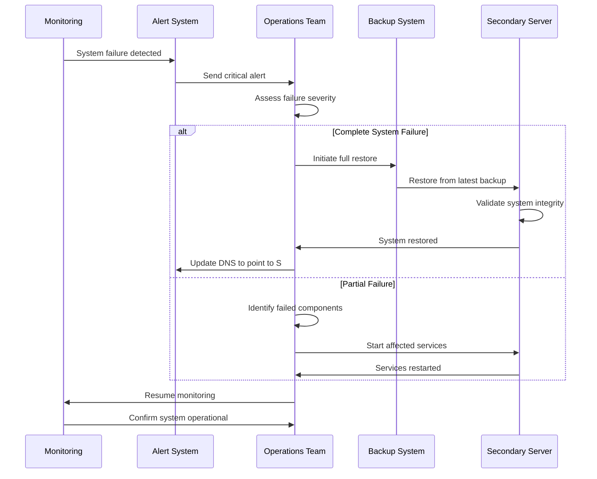

---

## Scaling Workflows

### 1. Horizontal Scaling Workflow

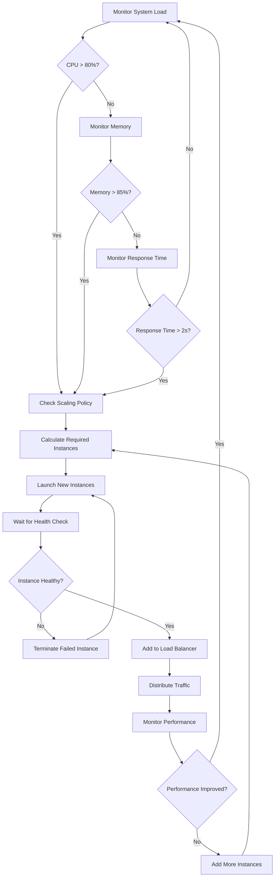

### 2. Database Scaling Workflow

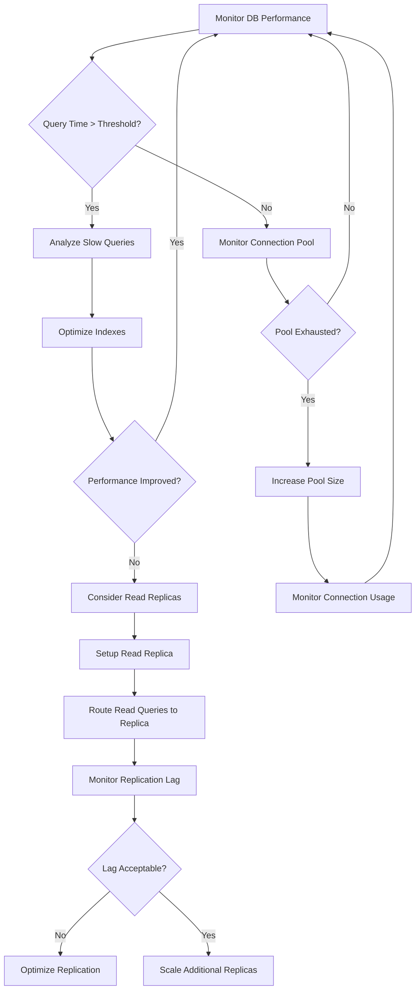

---

## Third-Party Integration Workflows

### 1. Email Notification Service Integration

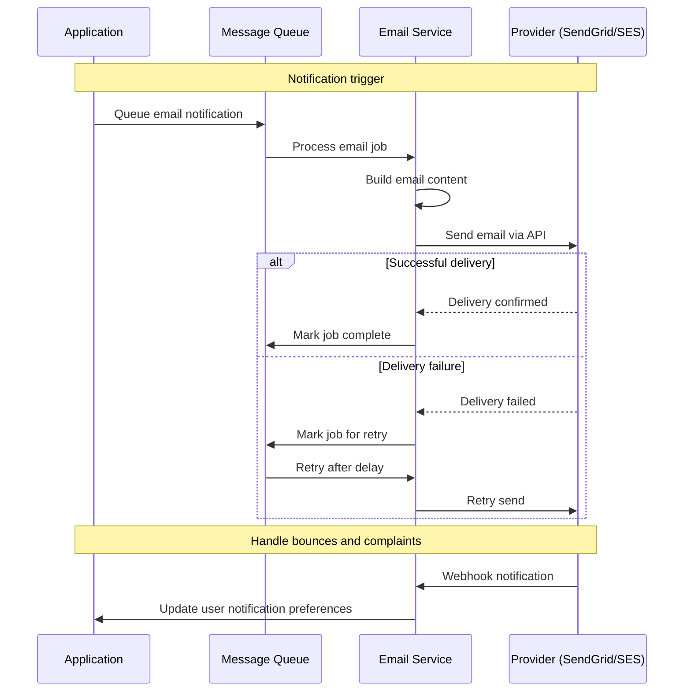

### 2. Single Sign-On (SSO) Integration

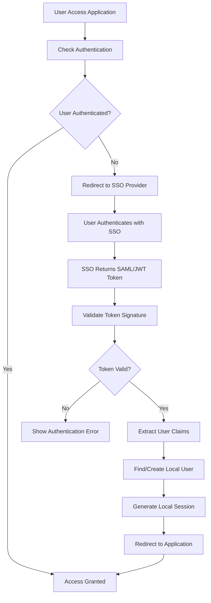

---

## Advanced Analytics Workflows

### 1. Predictive Analytics Workflow

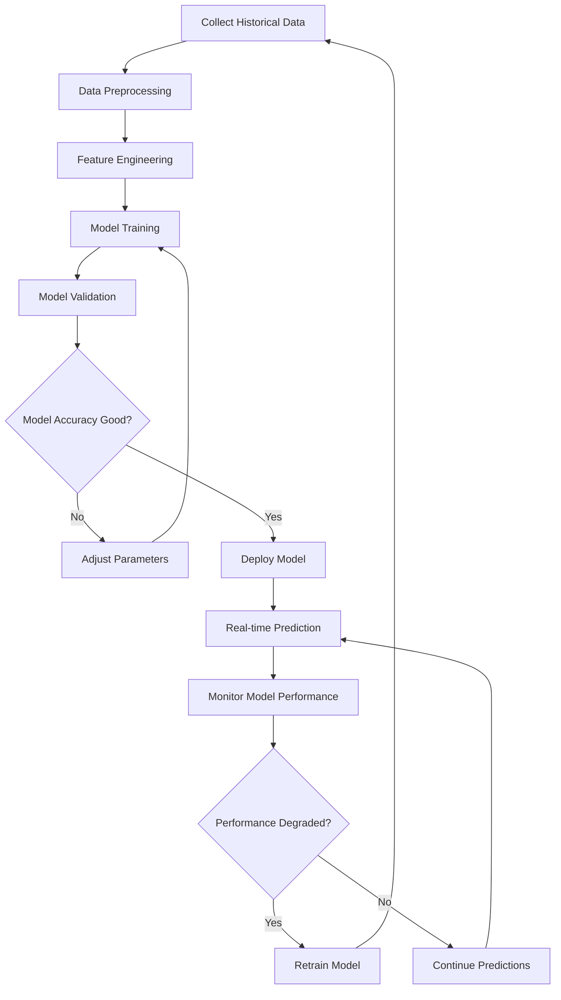

**Implementation Example:**

```python
# Productivity prediction model
import pandas as pd
from sklearn.ensemble import RandomForestRegressor
from sklearn.model_selection import train_test_split

class ProductivityPredictor:
    def __init__(self):
        self.model = RandomForestRegressor(n_estimators=100)
        
    def prepare_features(self, data):
        # Feature engineering
        features = pd.DataFrame({
            'hour_of_day': data['timestamp'].dt.hour,
            'day_of_week': data['timestamp'].dt.dayofweek,
            'avg_session_length': data.groupby('user_id')['session_length'].transform('mean'),
            'process_diversity': data.groupby('user_id')['process_name'].nunique(),
            'break_frequency': data.groupby('user_id')['break_count'].transform('sum')
        })
        return features
    
    def train(self, historical_data):
        features = self.prepare_features(historical_data)
        target = historical_data['productivity_score']
        
        X_train, X_test, y_train, y_test = train_test_split(
            features, target, test_size=0.2, random_state=42
        )
        
        self.model.fit(X_train, y_train)
        accuracy = self.model.score(X_test, y_test)
        return accuracy
    
    def predict_productivity(self, current_data):
        features = self.prepare_features(current_data)
        prediction = self.model.predict(features)
        return prediction[0]
```

### 2. Real-time Anomaly Detection

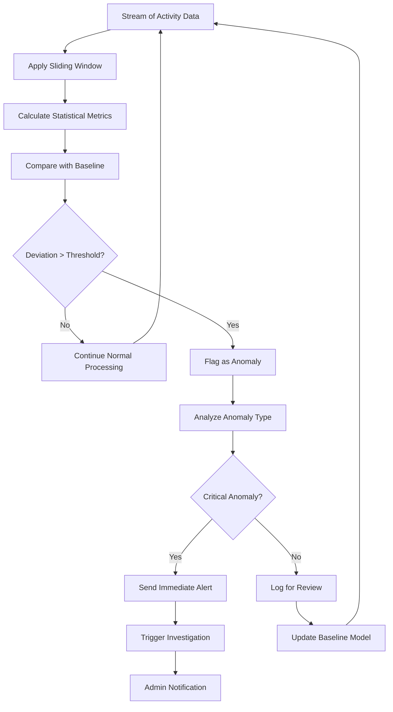

This advanced workflow documentation complements the existing comprehensive workflow guide, providing detailed implementation guidance for complex scenarios, error recovery, performance optimization, and advanced system integration patterns.
