# Employee Productivity Tracking System - Complete Workflow Documentation

## Table of Contents
1. [System Workflow Overview](#system-workflow-overview)
2. [User Authentication Workflow](#user-authentication-workflow)
3. [Employee Daily Workflow](#employee-daily-workflow)
4. [Process Tracking Workflow](#process-tracking-workflow)
5. [Activity Logging Workflow](#activity-logging-workflow)
6. [Admin Management Workflow](#admin-management-workflow)
7. [Analytics Generation Workflow](#analytics-generation-workflow)
8. [Data Flow Architecture](#data-flow-architecture)
9. [Error Handling Workflow](#error-handling-workflow)
10. [Security Workflow](#security-workflow)
11. [Deployment Workflow](#deployment-workflow)
12. [Development Workflow](#development-workflow)

---

## System Workflow Overview

The Employee Productivity Tracking System follows a comprehensive workflow that encompasses user management, real-time process monitoring, activity tracking, and analytics generation. The system operates on a role-based architecture with three main user types: EMPLOYEE, ADMIN, and SUPERADMIN.

### High-Level System Flow
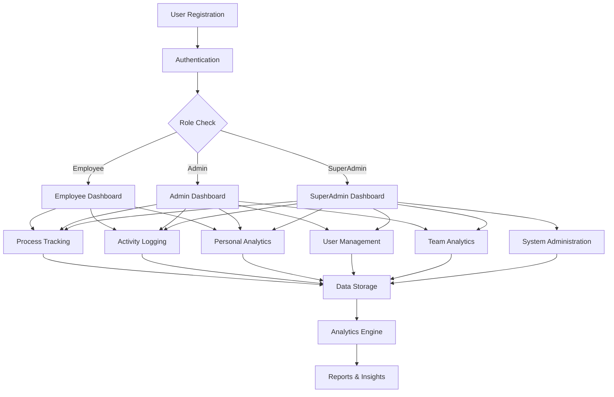

---

## User Authentication Workflow

### 1. User Registration Process

#### Step 1: Registration Request
```
Frontend --> POST /api/users/register --> Backend
```

**Request Flow:**
1. User fills registration form (username, email, password, role)
2. Frontend validates input data
3. Frontend sends POST request to `/api/users/register`
4. Backend validates data format and uniqueness
5. Backend encrypts password using BCrypt
6. Backend assigns role (EMPLOYEE by default, ADMIN/SUPERADMIN by admin)
7. Backend saves user to database
8. Backend returns user details (without password)

**Validation Rules:**
- Username: Unique, 3-50 characters, alphanumeric + underscore
- Email: Valid email format, unique
- Password: Minimum 8 characters, at least 1 uppercase, 1 lowercase, 1 number
- Role: Must be EMPLOYEE, ADMIN, or SUPERADMIN

#### Step 2: Account Activation
```
User Registration --> Email Verification (Optional) --> Account Active
```

### 2. User Login Process

#### Authentication Flow
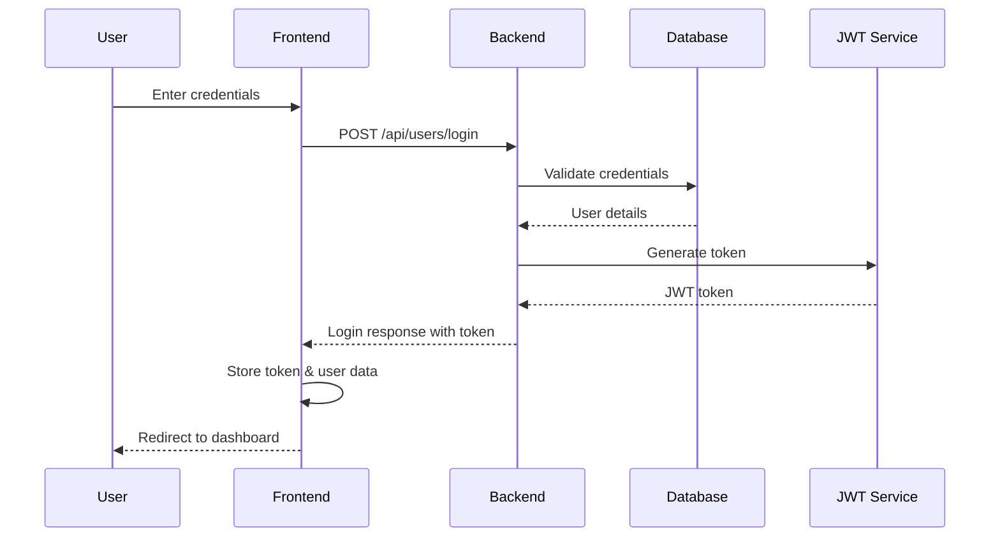

**Login Steps:**
1. User enters username/password
2. Frontend sends POST to `/api/users/login`
3. Backend validates credentials against database
4. Backend checks if user is active
5. Backend generates JWT token with user role and permissions
6. Backend returns response with:
   - JWT token
   - User ID
   - Username
   - Email
   - Role
   - Permissions object
7. Frontend stores token in localStorage/sessionStorage
8. Frontend redirects user to appropriate dashboard

### 3. Token Management Workflow

#### Token Lifecycle
```
Token Generation --> Token Storage --> Token Usage --> Token Validation --> Token Refresh/Expiry
```

**Token Validation Process:**
1. Every API request includes `Authorization: Bearer <token>` header
2. JWT filter extracts and validates token
3. If valid: Request proceeds with user context
4. If invalid/expired: Return 401 Unauthorized
5. Frontend handles 401 by redirecting to login

---

## Employee Daily Workflow

### 1. Employee Login and Dashboard Access

#### Morning Routine
```
Employee Login --> Dashboard Load --> Process Monitoring Start --> Activity Tracking Begin
```

**Workflow Steps:**
1. **Login (8:00 AM)**
   - Employee opens application
   - Enters credentials
   - System validates and provides dashboard access

2. **Dashboard Initialization**
   - Load personal statistics
   - Display daily goals/targets
   - Show recent activities
   - Initialize process monitoring

3. **Automatic Monitoring Setup**
   - System starts background process tracking
   - Activity timer begins
   - Resource usage monitoring activates

### 2. Work Session Management

#### Continuous Monitoring Cycle
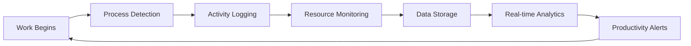

**Hourly Workflow:**
1. **Process Detection (Every 30 seconds)**
   - System scans running processes
   - Identifies work-related applications
   - Logs process start/stop times
   - Monitors CPU and memory usage

2. **Activity Classification (Every 5 minutes)**
   - Categorizes activities (productive, neutral, unproductive)
   - Calculates time spent per application
   - Updates activity logs
   - Triggers productivity alerts if needed

3. **Break Management**
   - Detects extended idle times
   - Logs break periods
   - Provides break reminders
   - Maintains work-life balance metrics

### 3. End-of-Day Process

#### Daily Wrap-up Sequence
```
Work End --> Final Data Sync --> Daily Report Generation --> Logout
```

**Steps:**
1. **Data Finalization (5:00 PM)**
   - Final process data collection
   - Activity summation
   - Daily productivity calculation

2. **Report Generation**
   - Generate daily productivity report
   - Calculate productivity score
   - Identify top applications used
   - Create time distribution charts

3. **Data Sync and Logout**
   - Sync all data to server
   - Clear local cache
   - Log out securely

---

## Process Tracking Workflow

### 1. Real-time Process Monitor

#### Process Detection Cycle
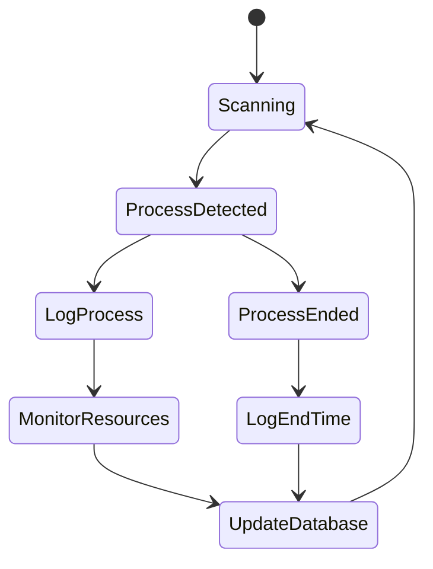

**Process Tracking Steps:**

1. **System Scan (Every 30 seconds)**
   ```javascript
   // Pseudocode for process scanning
   processes = getRunningProcesses()
   for each process in processes:
       if (process.isNew()):
           logProcessStart(process)
       if (process.hasEnded()):
           logProcessEnd(process)
       updateResourceUsage(process)
   ```

2. **Process Logging**
   - Log process name and ID
   - Record start timestamp
   - Monitor parent process relationships
   - Track window titles and focus

3. **Resource Monitoring**
   - CPU usage percentage
   - Memory consumption (RAM)
   - Disk I/O operations
   - Network activity

4. **Data Storage**
   ```sql
   INSERT INTO process_track (
       user_id, process_name, process_id, 
       start_time, cpu_usage, memory_usage, created_at
   ) VALUES (?, ?, ?, ?, ?, ?, ?)
   ```

### 2. Process Classification

#### Application Categorization
```
Process Detection --> Category Classification --> Productivity Scoring --> Storage
```

**Categories:**
- **Productive**: IDEs, Office applications, Work-related browsers
- **Neutral**: System processes, File managers, Communication tools
- **Unproductive**: Games, Social media, Entertainment apps

**Classification Rules:**
```javascript
function classifyProcess(processName) {
    const productiveApps = ['code.exe', 'excel.exe', 'word.exe', 'chrome.exe'];
    const unproductiveApps = ['game.exe', 'spotify.exe', 'discord.exe'];
    
    if (productiveApps.includes(processName)) return 'PRODUCTIVE';
    if (unproductiveApps.includes(processName)) return 'UNPRODUCTIVE';
    return 'NEUTRAL';
}
```

---

## Activity Logging Workflow

### 1. Activity Detection and Logging

#### Activity Lifecycle
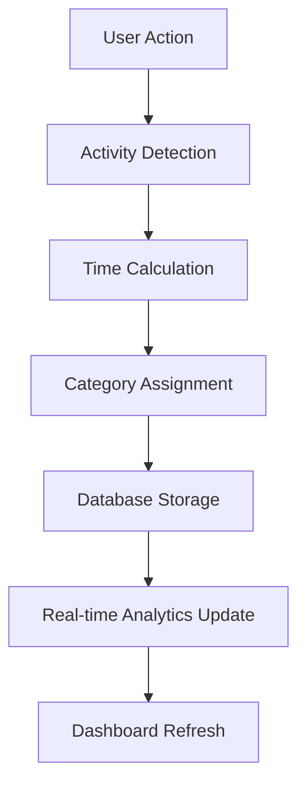

**Activity Logging Process:**

1. **Activity Start Detection**
   - Mouse/keyboard activity detection
   - Window focus changes
   - Application launches

2. **Activity Timing**
   ```javascript
   // Activity timing logic
   activityStart = getCurrentTime()
   onActivityChange = function() {
       activityEnd = getCurrentTime()
       duration = calculateDuration(activityStart, activityEnd)
       logActivity(currentActivity, duration)
       activityStart = getCurrentTime()
   }
   ```

3. **Data Structure**
   ```json
   {
       "userId": 123,
       "activityName": "Code Development",
       "startTime": "2025-06-17T09:00:00",
       "endTime": "2025-06-17T10:30:00",
       "durationMinutes": 90,
       "category": "PRODUCTIVE",
       "applicationUsed": "Visual Studio Code"
   }
   ```

### 2. Activity Analysis

#### Real-time Analysis Pipeline
```
Activity Data --> Pattern Recognition --> Productivity Calculation --> Alert Generation
```

**Analysis Components:**
1. **Time Distribution Analysis**
   - Calculate time per category
   - Identify peak productivity hours
   - Detect productivity patterns

2. **Productivity Scoring**
   ```javascript
   function calculateProductivityScore(activities) {
       let productiveTime = activities
           .filter(a => a.category === 'PRODUCTIVE')
           .reduce((sum, a) => sum + a.duration, 0);
       
       let totalTime = activities
           .reduce((sum, a) => sum + a.duration, 0);
       
       return (productiveTime / totalTime) * 100;
   }
   ```

---

## Admin Management Workflow

### 1. User Management Process

#### Admin User Operations
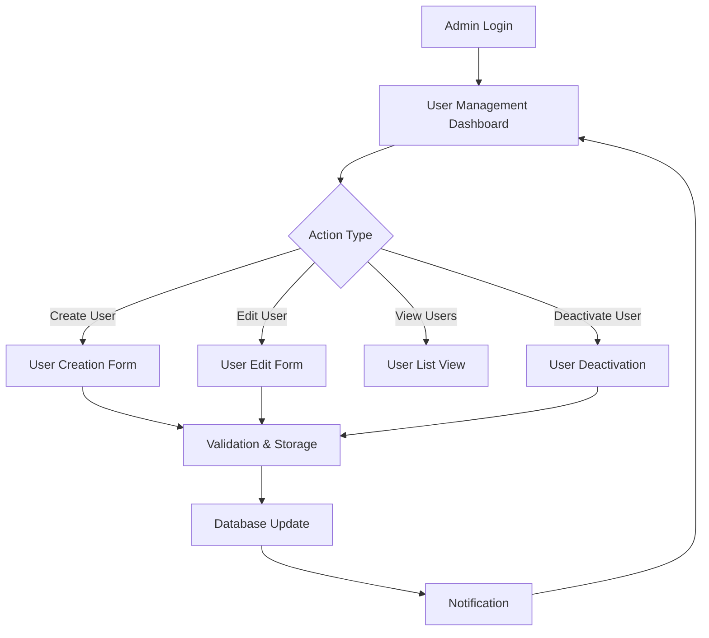

**Admin Workflow Steps:**

1. **User List Management**
   ```
   GET /api/users/all?role=EMPLOYEE&active=true&page=0&size=20
   ```
   - Filter users by role, status, date joined
   - Paginated results for large datasets
   - Search functionality by username/email

2. **User Creation Process**
   - Admin fills user creation form
   - System validates user data
   - Password auto-generation or manual entry
   - Role assignment based on admin level
   - Email notification to new user (optional)

3. **User Modification**
   - Edit user details (username, email, role)
   - Activate/deactivate user accounts
   - Reset user passwords
   - Change user roles (within admin privileges)

4. **Bulk Operations**
   - Import users from CSV
   - Bulk role assignments
   - Mass deactivation/activation
   - Export user reports

### 2. System Monitoring

#### Admin System Overview
```
System Metrics Collection --> Dashboard Display --> Alert Management --> Action Taking
```

**Monitoring Components:**
1. **User Activity Overview**
   - Total active users
   - Daily login statistics
   - User productivity averages
   - System usage patterns

2. **Performance Metrics**
   - API response times
   - Database performance
   - Server resource usage
   - Error rates and logs

---

## Analytics Generation Workflow

### 1. Data Aggregation Process

#### Analytics Pipeline
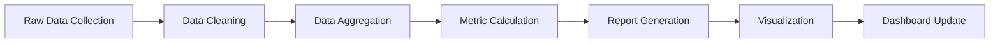

**Aggregation Steps:**

1. **Data Collection (Real-time)**
   ```sql
   -- Daily aggregation query
   SELECT 
       user_id,
       DATE(created_at) as date,
       COUNT(*) as total_activities,
       SUM(duration_minutes) as total_time,
       AVG(CASE WHEN category = 'PRODUCTIVE' THEN duration_minutes ELSE 0 END) as productive_time
   FROM activities 
   WHERE created_at >= DATE_SUB(NOW(), INTERVAL 1 DAY)
   GROUP BY user_id, DATE(created_at)
   ```

2. **Metric Calculations**
   ```javascript
   // Analytics calculations
   function generateUserAnalytics(userId, startDate, endDate) {
       const activities = getActivities(userId, startDate, endDate);
       const processes = getProcesses(userId, startDate, endDate);
       
       return {
           totalWorkTime: calculateTotalTime(activities),
           productivityScore: calculateProductivityScore(activities),
           topApplications: getTopApplications(processes),
           timeDistribution: getTimeDistribution(activities),
           trends: calculateTrends(activities),
           recommendations: generateRecommendations(activities)
       };
   }
   ```

### 2. Report Generation

#### Automated Reporting Cycle
```
Daily Data --> Weekly Summary --> Monthly Report --> Quarterly Analysis
```

**Report Types:**
1. **Daily Reports**
   - Individual productivity summary
   - Time spent per application
   - Break patterns
   - Productivity score

2. **Weekly Reports**
   - Weekly productivity trends
   - Comparison with previous weeks
   - Goal achievement status
   - Recommendations for improvement

3. **Monthly Reports**
   - Comprehensive productivity analysis
   - Team comparisons (for admins)
   - Productivity patterns
   - Detailed insights and recommendations

---

## Data Flow Architecture

### 1. Data Collection Flow

#### End-to-End Data Pipeline
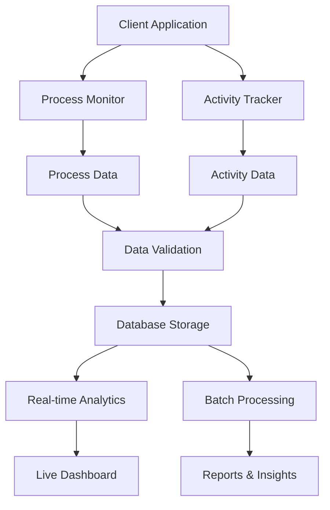

**Data Flow Steps:**

1. **Client-Side Collection**
   - Process monitoring service runs continuously
   - Activity tracking captures user interactions
   - Data batched for efficient transmission

2. **Data Transmission**
   ```javascript
   // Batch data transmission
   function sendDataBatch(dataArray) {
       fetch('/api/process-tracking/batch', {
           method: 'POST',
           headers: {
               'Authorization': `Bearer ${token}`,
               'Content-Type': 'application/json'
           },
           body: JSON.stringify(dataArray)
       });
   }
   ```

3. **Server-Side Processing**
   - Data validation and sanitization
   - Duplicate detection and removal
   - Database storage with transactions
   - Real-time analytics updates

### 2. Data Storage Strategy

#### Database Design Flow
```
Raw Data --> Validation --> Normalization --> Storage --> Indexing --> Archival
```

**Storage Layers:**
1. **Current Data** (Last 30 days)
   - High-performance access
   - Real-time queries
   - Dashboard data source

2. **Historical Data** (30+ days)
   - Compressed storage
   - Analytical queries
   - Report generation

3. **Archived Data** (1+ years)
   - Long-term storage
   - Compliance requirements
   - Historical trend analysis

---

## Error Handling Workflow

### 1. Error Detection and Classification

#### Error Handling Pipeline
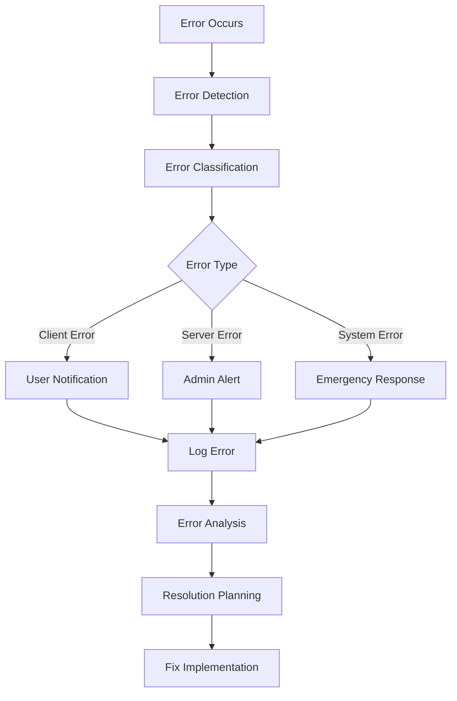

**Error Categories:**
1. **Authentication Errors** (401)
   - Invalid credentials
   - Expired tokens
   - Unauthorized access attempts

2. **Authorization Errors** (403)
   - Insufficient permissions
   - Role-based access violations
   - Resource access denied

3. **Validation Errors** (400)
   - Invalid input data
   - Missing required fields
   - Format violations

4. **System Errors** (500)
   - Database connection failures
   - Service unavailability
   - Internal processing errors

### 2. Error Recovery Process

#### Recovery Workflow
```
Error Detection --> Immediate Response --> Root Cause Analysis --> Permanent Fix --> Prevention
```

**Recovery Steps:**
1. **Immediate Response**
   - User-friendly error messages
   - Graceful degradation
   - Alternative workflows

2. **Data Recovery**
   - Unsaved data recovery
   - Session restoration
   - Data integrity checks

3. **System Recovery**
   - Service restart procedures
   - Database recovery
   - Cache rebuilding

---

## Security Workflow

### 1. Security Monitoring

#### Continuous Security Pipeline
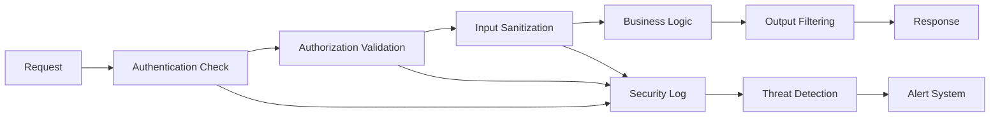

**Security Checkpoints:**
1. **Request Validation**
   - JWT token validation
   - Request rate limiting
   - Input sanitization
   - CORS validation

2. **Data Protection**
   - Sensitive data encryption
   - Password hashing
   - Data masking in logs
   - Secure data transmission

3. **Audit Trail**
   - All user actions logged
   - System access tracking
   - Data modification history
   - Security event logging

### 2. Threat Response

#### Security Incident Workflow
```
Threat Detection --> Risk Assessment --> Response Action --> Recovery --> Prevention
```

**Response Actions:**
1. **Immediate Response**
   - Block suspicious IP addresses
   - Disable compromised accounts
   - Revoke suspicious tokens
   - Alert administrators

2. **Investigation**
   - Analyze security logs
   - Identify attack vectors
   - Assess damage scope
   - Document findings

3. **Recovery and Prevention**
   - Patch security vulnerabilities
   - Update security policies
   - Enhance monitoring
   - User security training

---

## Deployment Workflow

### 1. Development to Production Pipeline

#### CI/CD Pipeline
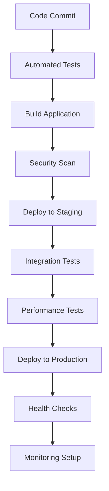

**Deployment Steps:**

1. **Pre-deployment**
   ```bash
   # Build and test
   mvn clean test
   mvn package
   
   # Security scan
   mvn dependency-check:check
   
   # Database migration
   mvn flyway:migrate
   ```

2. **Deployment Process**
   ```bash
   # Blue-green deployment
   docker build -t backend-app:latest .
   docker run -d --name backend-app-new backend-app:latest
   
   # Health check
   curl http://localhost:8081/actuator/health
   
   # Switch traffic
   nginx -s reload
   ```

3. **Post-deployment**
   - Verify all services running
   - Check database connectivity
   - Monitor application logs
   - Validate API endpoints

### 2. Environment Management

#### Environment Workflow
```
Development --> Testing --> Staging --> Production
```

**Environment Configurations:**
1. **Development**
   - Local database
   - Debug logging enabled
   - Hot reload enabled
   - Test data seeded

2. **Staging**
   - Production-like environment
   - Full integration testing
   - Performance monitoring
   - Security testing

3. **Production**
   - Optimized configuration
   - Enhanced security
   - Comprehensive monitoring
   - Automated backups

---

## Development Workflow

### 1. Feature Development Process

#### Development Lifecycle
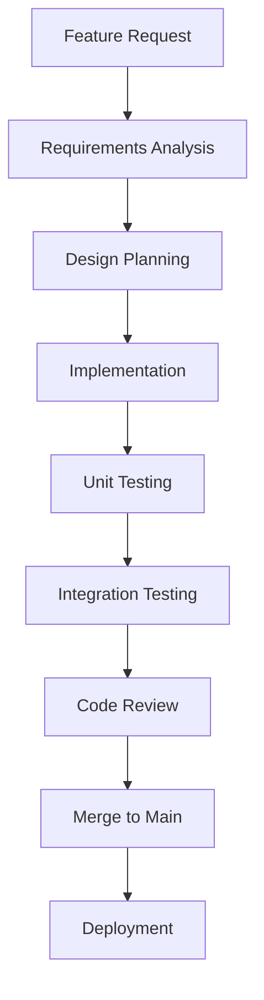

**Development Steps:**

1. **Planning Phase**
   - Analyze requirements
   - Design API endpoints
   - Plan database changes
   - Create test scenarios

2. **Implementation Phase**
   ```bash
   # Create feature branch
   git checkout -b feature/new-analytics
   
   # Implement changes
   # Add controllers, services, repositories
   
   # Write tests
   mvn test
   
   # Commit changes
   git commit -m "Add new analytics feature"
   ```

3. **Testing Phase**
   - Unit tests for individual components
   - Integration tests for API endpoints
   - Performance testing for new features
   - Security testing for vulnerabilities

4. **Review and Deployment**
   - Code review by team members
   - Merge to main branch
   - Automated deployment pipeline
   - Post-deployment verification

### 2. Maintenance Workflow

#### Ongoing Maintenance Process
```
Monitoring --> Issue Detection --> Triage --> Fix --> Testing --> Deployment --> Verification
```

**Maintenance Activities:**
1. **Regular Updates**
   - Security patches
   - Dependency updates
   - Performance optimizations
   - Bug fixes

2. **Database Maintenance**
   - Regular backups
   - Index optimization
   - Data archival
   - Performance tuning

3. **Monitoring and Alerts**
   - Application performance monitoring
   - Error rate tracking
   - Resource usage monitoring
   - User experience metrics

---

This comprehensive workflow documentation provides a complete guide to understanding how the Employee Productivity Tracking System operates from end-to-end. Each workflow is designed to ensure system reliability, security, and optimal user experience while maintaining data integrity and providing valuable insights into employee productivity patterns.
