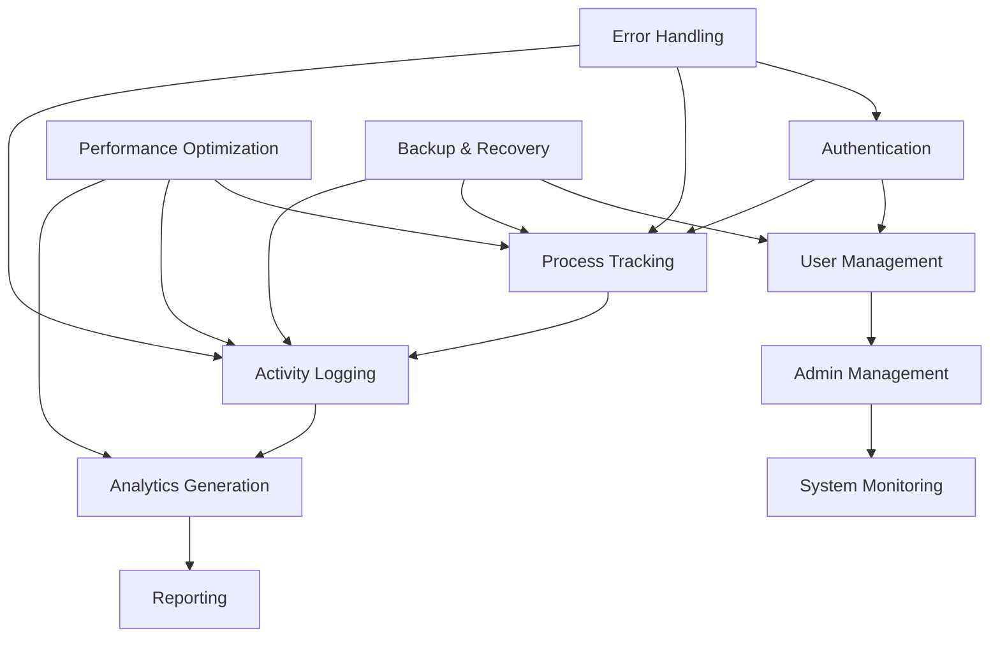

# Workflow Summary & Quick Reference Guide

## Overview

This document provides a quick reference to all workflows in the Employee Productivity Tracking System. Use this as a navigation guide to find specific workflow documentation.

---

## Core System Workflows

### 1. Authentication & Authorization Workflows
| Workflow | Location | Description |
|----------|----------|-------------|
| **User Registration** | SYSTEM_WORKFLOW_DOCUMENTATION.md | Complete user registration process |
| **User Login** | SYSTEM_WORKFLOW_DOCUMENTATION.md | Standard login workflow |
| **Multi-Device Login** | ADVANCED_WORKFLOWS.md | Managing sessions across multiple devices |
| **Token Refresh** | ADVANCED_WORKFLOWS.md | JWT token renewal process |
| **Role-Based Access** | SYSTEM_WORKFLOW_DOCUMENTATION.md | Permission checking and enforcement |

### 2. Employee Daily Workflows
| Workflow | Location | Description |
|----------|----------|-------------|
| **Morning Routine** | SYSTEM_WORKFLOW_DOCUMENTATION.md | Daily startup process |
| **Work Session Management** | SYSTEM_WORKFLOW_DOCUMENTATION.md | Continuous monitoring cycle |
| **Process Tracking** | SYSTEM_WORKFLOW_DOCUMENTATION.md | Start/stop process monitoring |
| **Activity Logging** | SYSTEM_WORKFLOW_DOCUMENTATION.md | Real-time activity capture |
| **End of Day** | SYSTEM_WORKFLOW_DOCUMENTATION.md | Daily wrap-up process |

### 3. Admin Management Workflows
| Workflow | Location | Description |
|----------|----------|-------------|
| **User Management** | SYSTEM_WORKFLOW_DOCUMENTATION.md | CRUD operations for users |
| **Role Assignment** | SYSTEM_WORKFLOW_DOCUMENTATION.md | Changing user roles |
| **Team Analytics** | SYSTEM_WORKFLOW_DOCUMENTATION.md | Generating team reports |
| **System Monitoring** | SYSTEM_WORKFLOW_DOCUMENTATION.md | Health checks and alerts |

---

## Technical Implementation Workflows

### 4. Data Management Workflows
| Workflow | Location | Description |
|----------|----------|-------------|
| **Data Collection** | SYSTEM_WORKFLOW_DOCUMENTATION.md | How data flows through the system |
| **Data Storage** | SYSTEM_WORKFLOW_DOCUMENTATION.md | Database storage strategy |
| **Data Validation** | SYSTEM_WORKFLOW_DOCUMENTATION.md | Input validation process |
| **Backup & Recovery** | ADVANCED_WORKFLOWS.md | Automated backup procedures |

### 5. Performance & Scaling Workflows
| Workflow | Location | Description |
|----------|----------|-------------|
| **Query Optimization** | ADVANCED_WORKFLOWS.md | Database performance tuning |
| **Memory Management** | ADVANCED_WORKFLOWS.md | Resource optimization |
| **Horizontal Scaling** | ADVANCED_WORKFLOWS.md | Adding server instances |
| **Database Scaling** | ADVANCED_WORKFLOWS.md | Read replicas and optimization |

### 6. Error Handling & Recovery Workflows
| Workflow | Location | Description |
|----------|----------|-------------|
| **Database Connection Failure** | ADVANCED_WORKFLOWS.md | Recovery from DB failures |
| **Process Tracking Failure** | ADVANCED_WORKFLOWS.md | Handling tracking interruptions |
| **Authentication Errors** | SYSTEM_WORKFLOW_DOCUMENTATION.md | Auth error scenarios |
| **Validation Errors** | SYSTEM_WORKFLOW_DOCUMENTATION.md | Input validation failures |

---

## Integration Workflows

### 7. Frontend-Backend Integration
| Workflow | Location | Description |
|----------|----------|-------------|
| **State Synchronization** | ADVANCED_WORKFLOWS.md | Keeping frontend/backend in sync |
| **API Rate Limiting** | ADVANCED_WORKFLOWS.md | Controlling API usage |
| **Real-time Updates** | SYSTEM_WORKFLOW_DOCUMENTATION.md | WebSocket implementation |

### 8. Third-Party Integrations
| Workflow | Location | Description |
|----------|----------|-------------|
| **Email Notifications** | ADVANCED_WORKFLOWS.md | Email service integration |
| **SSO Integration** | ADVANCED_WORKFLOWS.md | Single sign-on implementation |
| **External APIs** | ADVANCED_WORKFLOWS.md | Third-party service calls |

---

## Analytics & Reporting Workflows

### 9. Standard Analytics
| Workflow | Location | Description |
|----------|----------|-------------|
| **Daily Reports** | SYSTEM_WORKFLOW_DOCUMENTATION.md | Personal productivity reports |
| **Weekly/Monthly Reports** | SYSTEM_WORKFLOW_DOCUMENTATION.md | Periodic analytics |
| **Team Comparisons** | SYSTEM_WORKFLOW_DOCUMENTATION.md | Cross-team analysis |

### 10. Advanced Analytics
| Workflow | Location | Description |
|----------|----------|-------------|
| **Predictive Analytics** | ADVANCED_WORKFLOWS.md | ML-based predictions |
| **Anomaly Detection** | ADVANCED_WORKFLOWS.md | Real-time anomaly identification |
| **Trend Analysis** | SYSTEM_WORKFLOW_DOCUMENTATION.md | Historical pattern analysis |

---

## DevOps & Deployment Workflows

### 11. Development Workflows
| Workflow | Location | Description |
|----------|----------|-------------|
| **Code Development** | SYSTEM_WORKFLOW_DOCUMENTATION.md | Development lifecycle |
| **Testing Process** | SYSTEM_WORKFLOW_DOCUMENTATION.md | Testing procedures |
| **Code Review** | SYSTEM_WORKFLOW_DOCUMENTATION.md | Review and approval |

### 12. Deployment Workflows
| Workflow | Location | Description |
|----------|----------|-------------|
| **CI/CD Pipeline** | SYSTEM_WORKFLOW_DOCUMENTATION.md | Automated deployment |
| **Staging Deployment** | SYSTEM_WORKFLOW_DOCUMENTATION.md | Pre-production testing |
| **Production Deployment** | SYSTEM_WORKFLOW_DOCUMENTATION.md | Live system updates |
| **Disaster Recovery** | ADVANCED_WORKFLOWS.md | Emergency procedures |

---

## Quick Reference: Common Use Cases

### For Frontend Developers
1. **User Authentication Flow**: SYSTEM_WORKFLOW_DOCUMENTATION.md → "User Authentication Workflow"
2. **API Integration**: ADVANCED_WORKFLOWS.md → "Frontend-Backend State Synchronization"
3. **Error Handling**: SYSTEM_WORKFLOW_DOCUMENTATION.md → "Error Handling Workflow"
4. **Real-time Updates**: SYSTEM_WORKFLOW_DOCUMENTATION.md → "Data Flow Architecture"

### For Backend Developers
1. **API Design**: SYSTEM_WORKFLOW_DOCUMENTATION.md → "Process Tracking Workflow"
2. **Database Operations**: ADVANCED_WORKFLOWS.md → "Query Optimization Workflow"
3. **Security Implementation**: SYSTEM_WORKFLOW_DOCUMENTATION.md → "Security Workflow"
4. **Performance Tuning**: ADVANCED_WORKFLOWS.md → "Performance Optimization Workflows"

### For DevOps Engineers
1. **Deployment Process**: SYSTEM_WORKFLOW_DOCUMENTATION.md → "Deployment Workflow"
2. **Monitoring Setup**: SYSTEM_WORKFLOW_DOCUMENTATION.md → "Development Workflow"
3. **Backup Procedures**: ADVANCED_WORKFLOWS.md → "Backup & Recovery Workflows"
4. **Scaling Strategy**: ADVANCED_WORKFLOWS.md → "Scaling Workflows"

### For System Administrators
1. **User Management**: SYSTEM_WORKFLOW_DOCUMENTATION.md → "Admin Management Workflow"
2. **System Health**: ADVANCED_WORKFLOWS.md → "Database Connection Failure Recovery"
3. **Security Monitoring**: SYSTEM_WORKFLOW_DOCUMENTATION.md → "Security Workflow"
4. **Backup Management**: ADVANCED_WORKFLOWS.md → "Automated Backup Workflow"

---

## Implementation Priority

### Phase 1: Core Functionality
1. User Authentication Workflow
2. Employee Daily Workflow
3. Process Tracking Workflow
4. Basic Analytics Workflow

### Phase 2: Enhanced Features
1. Admin Management Workflows
2. Advanced Error Handling
3. Performance Optimization
4. Backup & Recovery

### Phase 3: Advanced Features
1. Multi-Device Login Management
2. Predictive Analytics
3. Real-time Anomaly Detection
4. Third-Party Integrations

### Phase 4: Scalability & Optimization
1. Horizontal Scaling Workflows
2. Advanced Database Optimization
3. Comprehensive Monitoring
4. Disaster Recovery

---

## Workflow Dependencies

---

## Testing Workflows

### Unit Testing Workflow
1. **Authentication Tests**: Test login, registration, token validation
2. **Service Layer Tests**: Test business logic in services
3. **Repository Tests**: Test database operations
4. **Controller Tests**: Test API endpoints

### Integration Testing Workflow
1. **API Integration Tests**: End-to-end API testing
2. **Database Integration Tests**: Test with real database
3. **External Service Tests**: Test third-party integrations
4. **Security Tests**: Test authentication and authorization

### Performance Testing Workflow
1. **Load Testing**: Test system under normal load
2. **Stress Testing**: Test system under peak load
3. **Endurance Testing**: Test system over extended periods
4. **Spike Testing**: Test system with sudden load increases

---

## Monitoring & Alerting Workflows

### Application Monitoring
- **Performance Metrics**: Response times, throughput, error rates
- **Business Metrics**: User engagement, feature usage, productivity scores
- **Technical Metrics**: Database performance, memory usage, CPU utilization

### Alert Workflows
1. **Critical Alerts**: System down, database failure, security breach
2. **Warning Alerts**: High error rates, performance degradation, capacity issues
3. **Info Alerts**: Deployment completion, backup status, user milestones

---

## Documentation Maintenance

### Regular Updates Required
- **API Changes**: Update workflow documentation when APIs change
- **New Features**: Document new workflows when features are added
- **Performance Improvements**: Update optimization workflows
- **Security Updates**: Revise security workflows as needed

### Review Schedule
- **Monthly**: Review error handling and performance workflows
- **Quarterly**: Review all integration workflows
- **Semi-annually**: Complete workflow documentation review
- **Annually**: Architecture and scaling workflow updates

---

This quick reference guide serves as your navigation tool for understanding and implementing all workflows in the Employee Productivity Tracking System. Each workflow is designed to be modular and can be implemented independently while maintaining system coherence.
