# Backend System Workflows & Architecture

## 📋 Table of Contents
1. [System Architecture Overview](#system-architecture-overview)
2. [Authentication Flow](#authentication-flow)
3. [Activity Tracking Workflow](#activity-tracking-workflow)
4. [User Management Workflow](#user-management-workflow)
5. [Task Management Workflow](#task-management-workflow)
6. [Data Integrity & Validation](#data-integrity--validation)
7. [Security Workflows](#security-workflows)
8. [Error Handling & Recovery](#error-handling--recovery)
9. [Database Operations](#database-operations)
10. [Monitoring & Logging](#monitoring--logging)
11. [Deployment Workflow](#deployment-workflow)
12. [Troubleshooting Workflows](#troubleshooting-workflows)

---

## 🏗️ System Architecture Overview

### High-Level Architecture
```
┌─────────────────────────────────────────────────────────────┐
│                    CLIENT APPLICATIONS                      │
├─────────────────────────────────────────────────────────────┤
│  Web Dashboard  │  Desktop Client  │  Mobile App  │  APIs   │
└─────────────────┴──────────────────┴──────────────┴─────────┘
                              │
                              ▼
┌─────────────────────────────────────────────────────────────┐
│                     LOAD BALANCER                          │
│                  (Future Enhancement)                       │
└─────────────────────────────────────────────────────────────┘
                              │
                              ▼
┌─────────────────────────────────────────────────────────────┐
│                  SPRING BOOT APPLICATION                    │
├─────────────────────┬───────────────────┬───────────────────┤
│   AUTHENTICATION    │   BUSINESS LOGIC  │   DATA ACCESS     │
│   - JWT Tokens      │   - Activity Log  │   - JPA/Hibernate │
│   - Role-based Auth │   - User Mgmt     │   - Repositories  │
│   - Session Mgmt    │   - Task Mgmt     │   - Transactions  │
└─────────────────────┴───────────────────┴───────────────────┘
                              │
                              ▼
┌─────────────────────────────────────────────────────────────┐
│                   SQL SERVER DATABASE                      │
├─────────────────────────────────────────────────────────────┤
│  Users │ Activities │ Tasks │ Process_Tracks │ Audit_Logs   │
└─────────────────────────────────────────────────────────────┘
```

### Technology Stack
- **Backend Framework**: Spring Boot 3.x
- **Database**: Microsoft SQL Server
- **Authentication**: JWT (JSON Web Tokens)
- **ORM**: Hibernate/JPA
- **Build Tool**: Maven
- **Java Version**: 17+

---

## 🔐 Authentication Flow

### 1. User Login Process
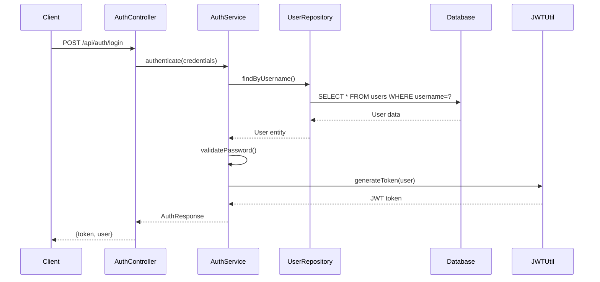

### 2. Token Validation Flow
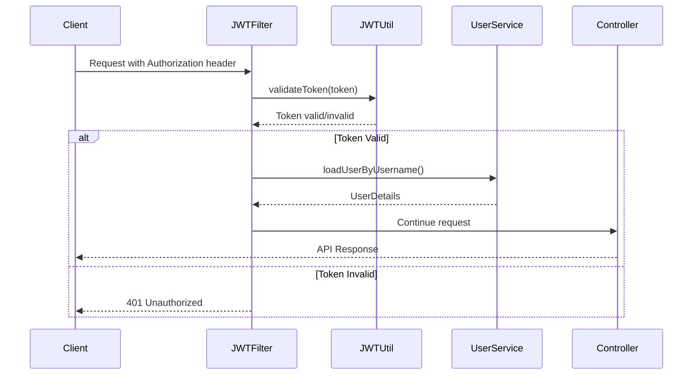

### 3. Role-Based Access Control
```
Authentication Flow:
1. User provides credentials
2. System validates against database
3. JWT token generated with user roles
4. Each request validates token and checks permissions

Role Hierarchy:
┌─────────────┐
│ ROLE_ADMIN  │ ← Full system access
├─────────────┤
│ ROLE_MANAGER│ ← Team management + Employee permissions
├─────────────┤
│ ROLE_EMPLOYEE│ ← Basic user permissions
└─────────────┘

Permission Matrix:
┌─────────────────────┬─────────┬─────────┬───────────┐
│ Action              │ Employee│ Manager │ Admin     │
├─────────────────────┼─────────┼─────────┼───────────┤
│ View own profile    │    ✓    │    ✓    │     ✓     │
│ Update own profile  │    ✓    │    ✓    │     ✓     │
│ Log activities      │    ✓    │    ✓    │     ✓     │
│ View own activities │    ✓    │    ✓    │     ✓     │
│ View team activities│    ✗    │    ✓    │     ✓     │
│ Create tasks        │    ✗    │    ✓    │     ✓     │
│ Manage users        │    ✗    │    ✗    │     ✓     │
│ System admin        │    ✗    │    ✗    │     ✓     │
└─────────────────────┴─────────┴─────────┴───────────┘
```

---

## 📊 Activity Tracking Workflow

### 1. Activity Logging Process
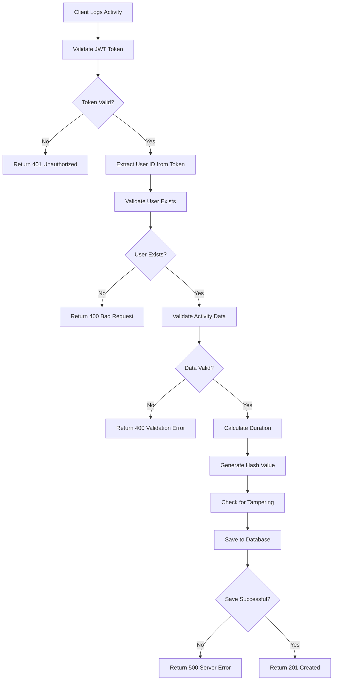

### 2. Activity Data Validation Rules
```
Required Fields:
- activityType: Must be valid enum value
- userId: Must exist in users table (enforced by FK)
- startTime: Must be valid datetime
- machineId: Must be non-empty string

Optional Fields:
- endTime: If provided, must be after startTime
- durationSeconds: Auto-calculated if start/end provided
- applicationName: String, max 255 chars
- description: String, max 2000 chars

Business Rules:
1. End time must be after start time
2. Duration must be positive
3. User must exist (enforced by database FK constraint)
4. Activity type must be from predefined enum
5. Hash value generated for integrity checking
6. Tamper detection based on hash validation
```

### 3. Activity Retrieval Workflow
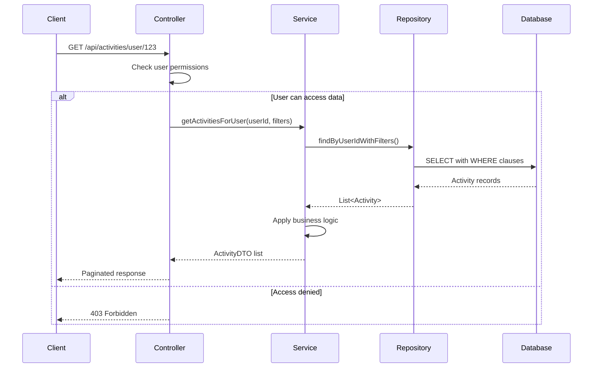

---

## 👥 User Management Workflow

### 1. User Creation Process (Admin)
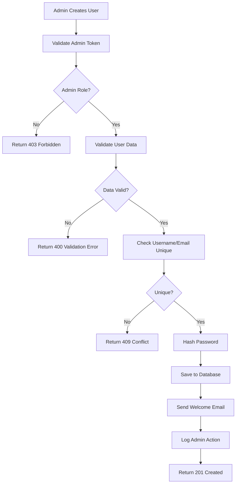

### 2. Profile Update Workflow
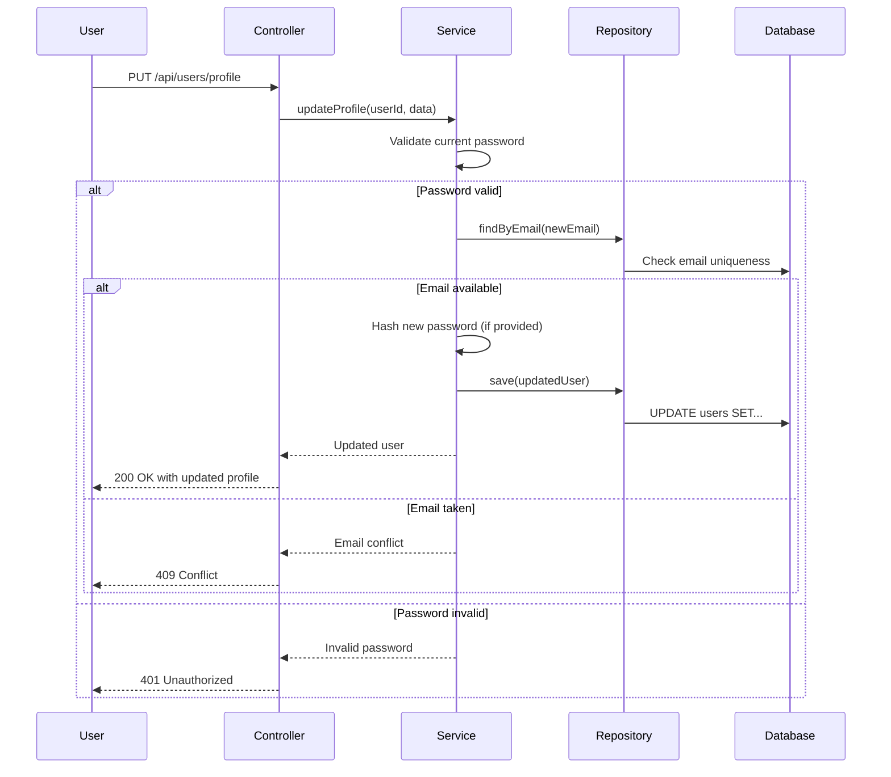

### 3. User Deactivation Process
```
Soft Delete Approach:
1. Admin initiates user deactivation
2. System sets user.active = false
3. Foreign key constraint with CASCADE DELETE handles activities
4. User can no longer authenticate
5. Historical data preserved for auditing

Hard Delete Approach (if needed):
1. Admin confirms permanent deletion
2. System deletes all related activities (CASCADE)
3. User record removed from database
4. Action logged for audit trail
```

---

## 📋 Task Management Workflow

### 1. Task Creation & Assignment
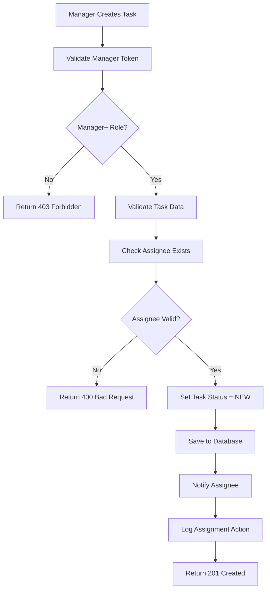

### 2. Task Status Updates
```
Status Flow:
NEW → IN_PROGRESS → COMPLETED
  ↓         ↓           ↓
CANCELLED ← ON_HOLD → REJECTED

Transition Rules:
- Only assignee can mark IN_PROGRESS → COMPLETED
- Only creator/admin can CANCEL tasks
- Manager+ can change any status
- Status changes logged with timestamp and user
```

### 3. Task Notification System
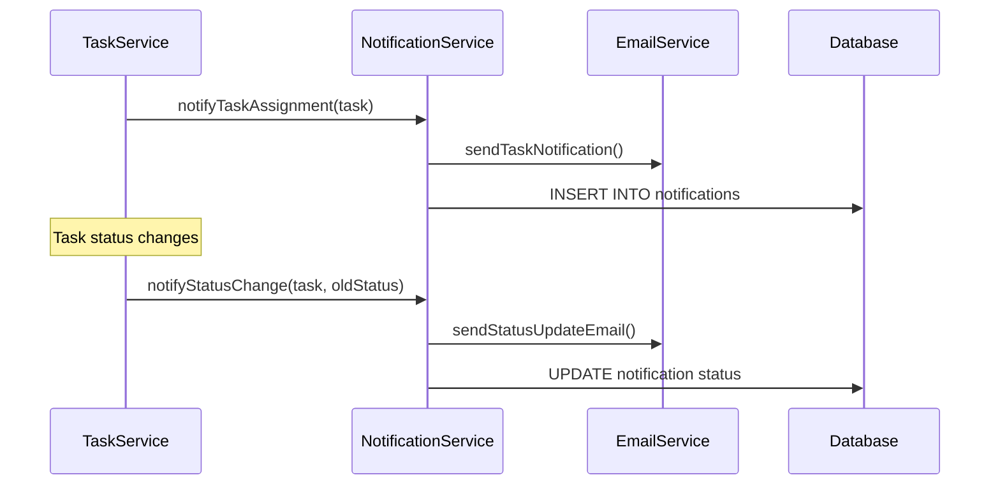

---

## 🔒 Data Integrity & Validation

### 1. Database Constraints & Foreign Keys
```sql
-- Current Database Schema with Constraints
CREATE TABLE users (
    id BIGINT IDENTITY(1,1) PRIMARY KEY,
    username VARCHAR(255) NOT NULL UNIQUE,
    email VARCHAR(255) NOT NULL UNIQUE,
    password VARCHAR(255) NOT NULL,
    role VARCHAR(50) NOT NULL DEFAULT 'ROLE_EMPLOYEE',
    active BIT NOT NULL DEFAULT 1,
    created_at DATETIME2 NOT NULL DEFAULT GETDATE()
);

CREATE TABLE activities (
    id BIGINT IDENTITY(1,1) PRIMARY KEY,
    user_id BIGINT NOT NULL,
    activity_type VARCHAR(255) NOT NULL,
    -- ... other fields ...
    created_at DATETIME2 NOT NULL DEFAULT GETDATE(),
    
    -- ✅ FIXED: Foreign key constraint prevents orphaned activities
    CONSTRAINT fk_activities_user_id 
    FOREIGN KEY (user_id) REFERENCES users(id) ON DELETE CASCADE
);

-- Performance indexes
CREATE INDEX idx_users_username ON users(username);
CREATE INDEX idx_users_email ON users(email);
CREATE INDEX idx_activities_user_id ON activities(user_id);
CREATE INDEX idx_activities_created_at ON activities(created_at);
```

### 2. Input Validation Pipeline
```
Client Input → Controller Validation → Service Validation → Database Constraints

Layer 1 - Controller (@Valid annotations):
- Required field validation
- Format validation (email, dates)
- Length constraints
- Pattern matching

Layer 2 - Service Layer:
- Business logic validation
- Cross-field validation
- Database uniqueness checks
- Permission validation

Layer 3 - Database Layer:
- NOT NULL constraints
- UNIQUE constraints
- FOREIGN KEY constraints
- CHECK constraints
```

### 3. Transaction Management
```java
@Transactional(rollbackFor = Exception.class)
public ActivityDTO logActivity(ActivityDTO activityDTO) {
    try {
        // 1. Validate user exists
        User user = userRepository.findById(activityDTO.getUserId())
            .orElseThrow(() -> new UserNotFoundException("User not found"));
        
        // 2. Create activity entity
        Activity activity = mapToEntity(activityDTO);
        activity.setCreatedAt(Instant.now());
        activity.setHashValue(generateHash(activity));
        
        // 3. Save to database
        Activity saved = activityRepository.save(activity);
        
        // 4. Log action for audit
        auditService.logActivity("ACTIVITY_CREATED", user.getId(), saved.getId());
        
        return mapToDTO(saved);
    } catch (Exception e) {
        // Transaction automatically rolled back
        log.error("Failed to log activity", e);
        throw new ActivityLoggingException("Failed to log activity", e);
    }
}
```

---

## 🛡️ Security Workflows

### 1. JWT Token Security
```
Token Generation:
1. User authenticates successfully
2. Generate JWT with:
   - User ID and username in payload
   - Role information for authorization
   - Expiration time (configurable)
   - Signed with secret key

Token Validation:
1. Extract token from Authorization header
2. Verify signature using secret key
3. Check expiration time
4. Validate user still exists and is active
5. Load user permissions for request
```

### 2. Password Security
```
Password Hashing:
- Algorithm: BCrypt with cost factor 12
- Salt: Automatically generated per password
- Storage: Only hashed passwords stored in database

Password Requirements:
- Minimum 8 characters
- At least one uppercase letter
- At least one lowercase letter  
- At least one number
- At least one special character

Password Change Process:
1. Verify current password
2. Validate new password requirements
3. Hash new password with BCrypt
4. Update database
5. Invalidate all existing tokens (optional)
```

### 3. API Security Headers
```
Security Headers Added:
- X-Content-Type-Options: nosniff
- X-Frame-Options: DENY
- X-XSS-Protection: 1; mode=block
- Strict-Transport-Security: max-age=31536000
- Content-Security-Policy: default-src 'self'

CORS Configuration:
- Allowed origins: Configured per environment
- Allowed methods: GET, POST, PUT, DELETE, OPTIONS
- Allowed headers: Authorization, Content-Type
- Credentials: true (for cookie-based sessions)
```

---

## ⚠️ Error Handling & Recovery

### 1. Exception Handling Hierarchy
```
GlobalExceptionHandler
├── AuthenticationException → 401 Unauthorized
├── AccessDeniedException → 403 Forbidden
├── UserNotFoundException → 404 Not Found
├── ValidationException → 400 Bad Request
├── ConflictException → 409 Conflict
├── DatabaseException → 500 Internal Server Error
└── GenericException → 500 Internal Server Error

Error Response Format:
{
    "success": false,
    "error": {
        "code": "USER_NOT_FOUND",
        "message": "User with ID 99999 not found",
        "details": "The specified user ID does not exist in the system",
        "timestamp": "2025-06-20T15:30:00Z",
        "path": "/api/users/99999"
    }
}
```

### 2. Database Error Recovery
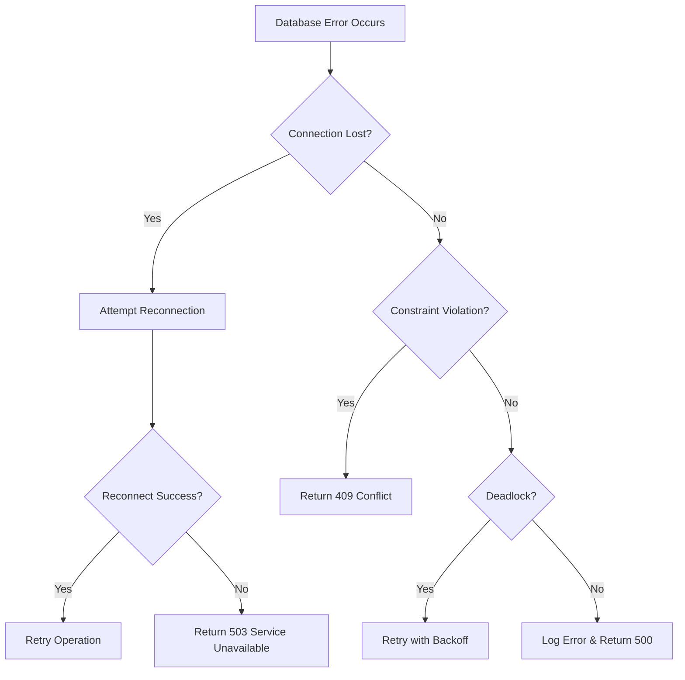

### 3. Retry & Circuit Breaker Pattern
```java
@Retryable(value = {DataAccessException.class}, maxAttempts = 3)
public Activity saveActivity(Activity activity) {
    try {
        return activityRepository.save(activity);
    } catch (DataAccessException e) {
        log.warn("Database operation failed, attempt {} of 3", 
                getCurrentAttempt());
        throw e;
    }
}

@Recover
public Activity recoverSaveActivity(DataAccessException ex, Activity activity) {
    log.error("All retry attempts failed for saving activity", ex);
    throw new ServiceUnavailableException("Database temporarily unavailable");
}
```

---

## 💾 Database Operations

### 1. Connection Pool Management
```
HikariCP Configuration:
- Maximum pool size: 20 connections
- Minimum idle connections: 5
- Connection timeout: 30 seconds
- Idle timeout: 600 seconds (10 minutes)
- Max lifetime: 1800 seconds (30 minutes)
- Leak detection threshold: 60 seconds

Connection Health Checks:
- Validation query: SELECT 1
- Test on borrow: true
- Test while idle: true
```

### 2. Query Optimization
```sql
-- Optimized queries with proper indexing
-- User activities with pagination
SELECT a.* FROM activities a 
WHERE a.user_id = ? 
    AND a.created_at BETWEEN ? AND ?
ORDER BY a.created_at DESC
LIMIT ? OFFSET ?;

-- Index support:
-- idx_activities_user_id (user_id)
-- idx_activities_created_at (created_at)
-- Composite index possible: (user_id, created_at)
```

### 3. Database Migration Strategy
```
Migration Approach:
1. Version-controlled SQL scripts in src/main/resources/db/migration/
2. Flyway for production migrations
3. Hibernate DDL validation in production
4. Rollback scripts for each migration

Current Migration Status:
✅ V1__Add_Activity_User_Foreign_Key.sql - Applied
✅ Orphaned activities cleanup - Applied
✅ Performance indexes - Applied

Future Migrations:
- V2__Add_Audit_Log_Table.sql
- V3__Add_User_Preferences_Table.sql
```

---

## 📊 Monitoring & Logging

### 1. Application Logging
```
Log Levels:
- ERROR: System errors, exceptions, critical failures
- WARN: Recoverable errors, validation failures
- INFO: Business events, user actions, system status
- DEBUG: Detailed flow information (dev/test only)
- TRACE: Very detailed debugging (dev only)

Log Categories:
com.example.backendapp.controller - API requests/responses
com.example.backendapp.service - Business logic events
com.example.backendapp.security - Authentication/authorization
com.example.backendapp.repository - Database operations
org.hibernate.SQL - SQL query logging (DEBUG level)
```

### 2. Audit Trail
```java
@Entity
public class AuditLog {
    private Long id;
    private String action;        // CREATE, UPDATE, DELETE, LOGIN, etc.
    private Long userId;          // Who performed the action
    private String resourceType;  // USER, ACTIVITY, TASK, etc.
    private Long resourceId;      // ID of affected resource
    private String oldValues;     // JSON of previous values
    private String newValues;     // JSON of new values
    private Instant timestamp;
    private String ipAddress;
    private String userAgent;
}

// Usage in services
auditService.log(AuditAction.USER_CREATED, currentUserId, newUser.getId());
auditService.log(AuditAction.ACTIVITY_LOGGED, userId, activity.getId());
```

### 3. Performance Monitoring
```
Metrics Tracked:
- Request/response times per endpoint
- Database query execution times
- Connection pool usage
- Memory and CPU utilization
- Error rates and types
- Active user sessions

Health Check Endpoints:
GET /actuator/health - Application health status
GET /actuator/metrics - Application metrics
GET /actuator/info - Application information
GET /admin/stats - Custom business metrics
```

---

## 🚀 Deployment Workflow

### 1. Build & Test Pipeline
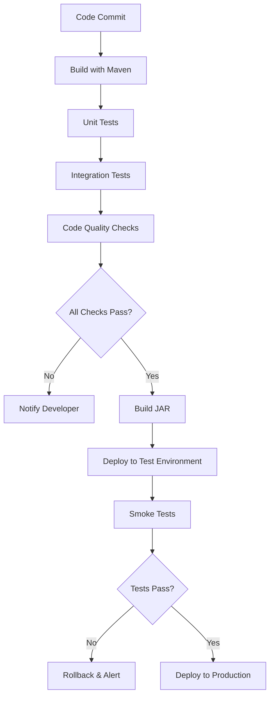

### 2. Environment Configuration
```
Development:
- Database: Local SQL Server
- Logging: DEBUG level
- JWT expiration: 24 hours
- CORS: Allow all origins

Testing:
- Database: Test SQL Server instance
- Logging: INFO level
- JWT expiration: 1 hour
- CORS: Specific test domains

Production:
- Database: Production SQL Server cluster
- Logging: WARN level
- JWT expiration: 30 minutes
- CORS: Production domains only
- HTTPS only
- Rate limiting enabled
```

### 3. Database Deployment
```
Production Database Updates:
1. Backup current database
2. Run migration scripts in transaction
3. Verify data integrity
4. Update application configuration
5. Deploy new application version
6. Smoke test critical functionality
7. Monitor for errors

Rollback Plan:
1. Stop application
2. Restore database from backup
3. Deploy previous application version
4. Verify functionality
5. Investigate and fix issues
```

---

## 🔧 Troubleshooting Workflows

### 1. Common Issues & Solutions

#### Orphaned Activities Issue (RESOLVED)
```
Problem: Activities existed for non-existent user IDs
Root Cause: Missing foreign key constraint
Solution Applied:
1. ✅ Added FK constraint: activities.user_id → users.id
2. ✅ Cleaned up existing orphaned data (1 record)
3. ✅ Enhanced backend validation
4. ✅ Added admin APIs for monitoring

Prevention: Database constraints + application validation
```

#### Authentication Issues
```
Common Problems:
1. Token expired → User needs to re-login
2. Invalid token format → Check Authorization header
3. User not found → Check user still exists and is active
4. Insufficient permissions → Check user role

Debugging Steps:
1. Check JWT token format and expiration
2. Verify user exists in database
3. Check user.active status
4. Validate role permissions
5. Review authentication logs
```

#### Database Connection Issues
```
Symptoms:
- Connection timeout errors
- Pool exhausted warnings
- Slow query performance

Troubleshooting:
1. Check connection pool metrics
2. Review long-running queries
3. Check database server health
4. Analyze connection usage patterns
5. Adjust pool configuration if needed
```

### 2. Performance Troubleshooting
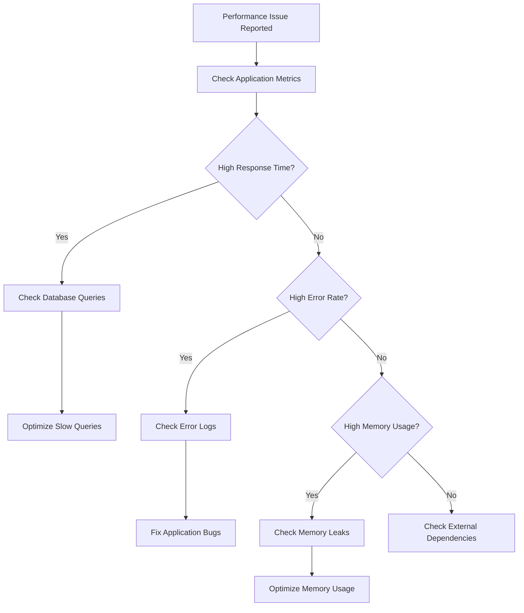

### 3. Data Integrity Checks
```sql
-- Regular data integrity checks
-- 1. Check for orphaned activities (should be 0)
SELECT COUNT(*) as orphaned_count 
FROM activities a 
LEFT JOIN users u ON a.user_id = u.id 
WHERE u.id IS NULL;

-- 2. Check for duplicate usernames/emails
SELECT username, COUNT(*) 
FROM users 
GROUP BY username 
HAVING COUNT(*) > 1;

-- 3. Verify foreign key constraints
SELECT 
    CONSTRAINT_NAME,
    TABLE_NAME,
    COLUMN_NAME
FROM INFORMATION_SCHEMA.KEY_COLUMN_USAGE 
WHERE CONSTRAINT_NAME LIKE 'fk_%';

-- 4. Check activity data consistency
SELECT 
    COUNT(*) as total_activities,
    COUNT(DISTINCT user_id) as unique_users,
    MIN(created_at) as oldest_activity,
    MAX(created_at) as newest_activity
FROM activities;
```

---

## 📈 System Metrics & KPIs

### Key Performance Indicators
```
Application Health:
- Uptime: Target 99.9%
- Response time: < 200ms for 95% of requests
- Error rate: < 0.1%
- Database connectivity: 100%

Business Metrics:
- Daily active users
- Activities logged per day
- Average session duration
- Task completion rate
- User productivity scores

Technical Metrics:
- Memory usage: < 80% of allocated
- CPU usage: < 70% average
- Database connections: < 80% of pool
- Disk space: < 85% used
```

### Alerting Thresholds
```
Critical Alerts:
- Application down for > 1 minute
- Database connection failures
- Error rate > 1% for 5 minutes
- Memory usage > 90%

Warning Alerts:
- Response time > 500ms for 2 minutes
- Error rate > 0.5% for 10 minutes
- Database connection pool > 90%
- Disk space > 90%
```

---

*This document provides comprehensive workflows and architecture information for the Employee Productivity Tracking Backend System. For specific API details, refer to the companion document: COMPLETE_BACKEND_API_REFERENCE.md*

---

**Document Version**: 1.0  
**Last Updated**: June 20, 2025  
**System Status**: ✅ Orphaned Activities Issue Resolved  
**Database Integrity**: ✅ Foreign Key Constraints Active
